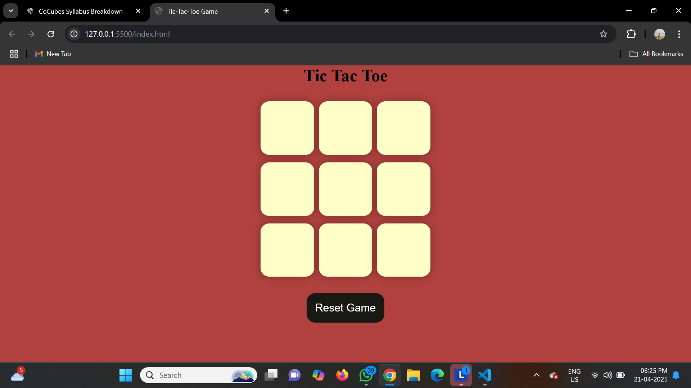
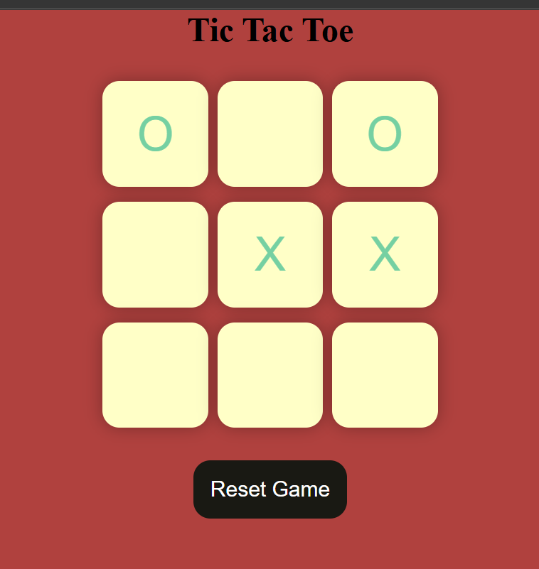
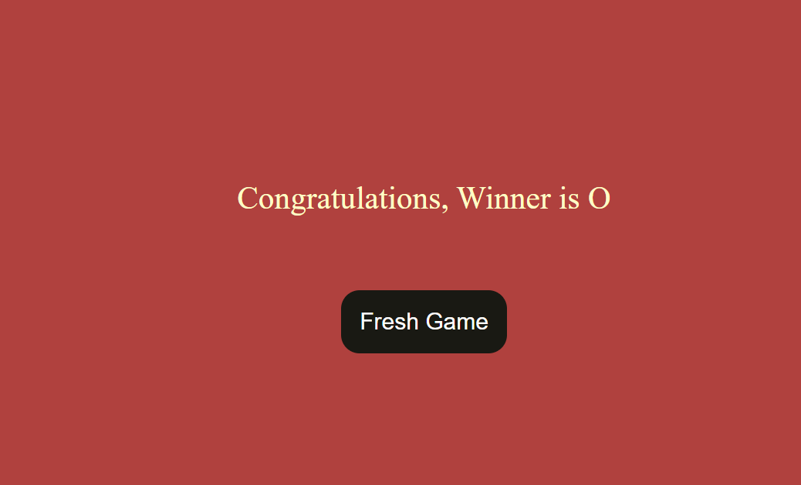

# 🎮 Tic Tac Toe Game

A simple and fun **Tic Tac Toe** game built using **HTML, CSS, and JavaScript**. Play with a friend and enjoy the classic 3x3 grid challenge right in your browser!

## ✨ Features

- Two-player mode
- Simple UI with responsive design
- Highlight winning combination
- Reset game option
- Clean and readable code structure

## 🛠️ Technologies Used

- HTML5
- CSS3
- JavaScript (Vanilla)

## 📸 Screenshots


 
## 🚀 How to Run

1. Clone the repository:

   ```bash
   git clone https:https://github.com/koushik-badineni/tic-tac-toe-Game.git)
